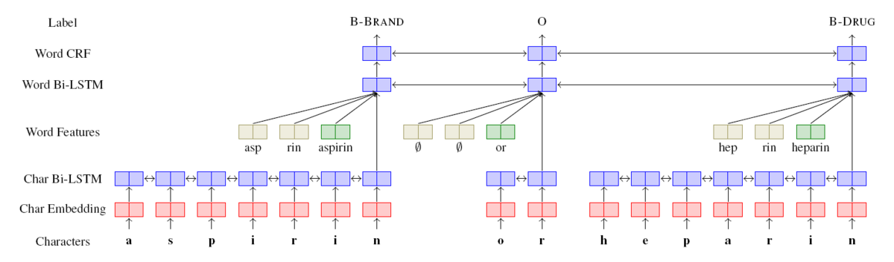

# NER-BiLSTM-CRF-Affix-PyTorch

+ A PyTorch implementation of a common NER model: BiLSTM-CRF with Character-Word-Capital-Affix-Level Feature.
+ Tips: Some code are referred from [ZhixiuYe/NER-pytorch](https://github.com/ZhixiuYe/NER-pytorch).
+ Paper: Bidirectional LSTM-CRF Models for Sequence Tagging - [arXiv](https://arxiv.org/abs/1508.01991)
+ Paper: Deep Affix Features Improve Neural Named Entity Recognizers - [ACL](https://aclanthology.org/S18-2021/)

### Architecture



### Dataset

+ NER dataset: [CoNLL-2003-English](https://www.clips.uantwerpen.be/conll2003/ner/), it can be downloaded from [release](https://github.com/Aoi-hosizora/NER-BiLSTM-CRF-PyTorch/releases/tag/v0.0.0) page.
+ Pretrained word embedding: [glove.6B.100d.txt](https://nlp.stanford.edu/projects/glove/), it can be downloaded from [here](http://nlp.stanford.edu/data/glove.6B.zip).

### Train

+ First, download eng.train, eng.testa, eng.testb, glove.6B.100d.txt and save to `./data/` folder.
+ To train, execute the following script. You can edit some parameters in [train.py](./train.py).
> Tips: The evaluate script will ask you to have a perl interpreter, commonly it has been installed on Linux systems.

```bash
python3 train.py \
    --output_mapping ./output/mapping.pkl \
    --output_affix_list ./output/affix_list.json \
    --use_crf 1 \
    --add_cap_feature 1 \
    --add_affix_feature 1 \
    --use_gpu 1 \
    --model_path ./model
```

### References

+ [vikas95/Pref_Suff_Span_NN](https://github.com/vikas95/Pref_Suff_Span_NN)
+ [ZhixiuYe/NER-pytorch](https://github.com/ZhixiuYe/NER-pytorch)
